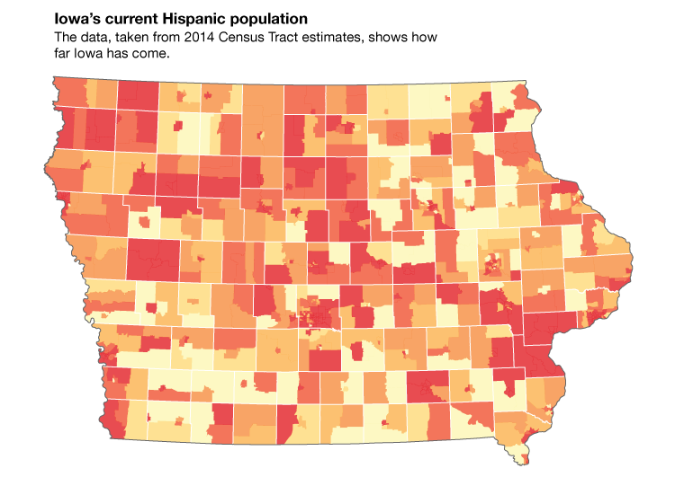
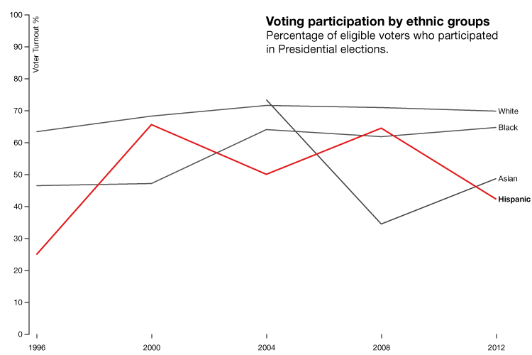

# DI-Hisp
Daily Iowan, Hispanic population analysis for the 2016 Presidential Election.

**Small Multiples**

</img>

**Detailed Map**

</img>

**Ethnic Participation**

</img>

**Election Votes**

</img>

**Justification of Calculated Variables.** This is on the premise that if you can vote, you should. Therefore instead of using the whole population, we're going to use the `Citizen` subset of it. The `Citizen` subset is the population that is of age (18+), legal U.S. residents, who haven't committed a felony or otherwise unable to vote. This *does* include those who aren't registered to vote so that we can get a bigger frame of reference than just those that registered.

| Var | Calculation | Justification |
|-----|-------------|---------------|
| Impact (% Voted of Overall) | # voted (of ethnic group) / # voted of overall | How much did this ethnic group influence the election? On a large scale, this decides elections. |
| Engagement (% Voted of ethnic group) | # voted (of ethnic group) / # people of ethnic group | How many people contributed to the election? Was politics an important topic for this group? On a small scale, this can win you an election (swing states, tight races, etc). |
